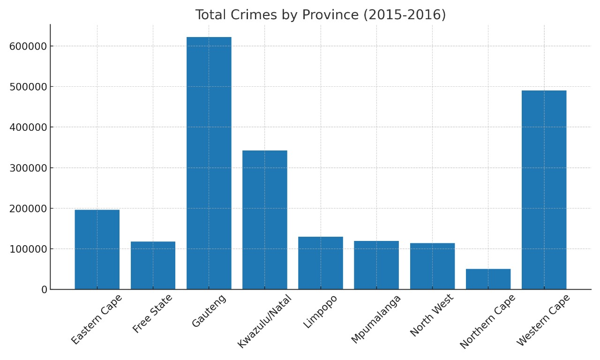
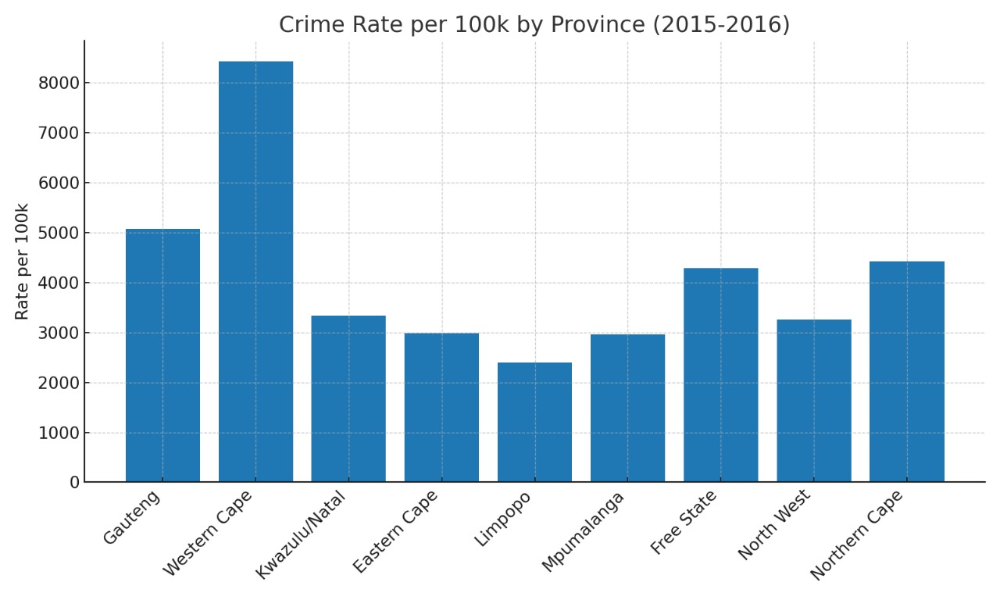
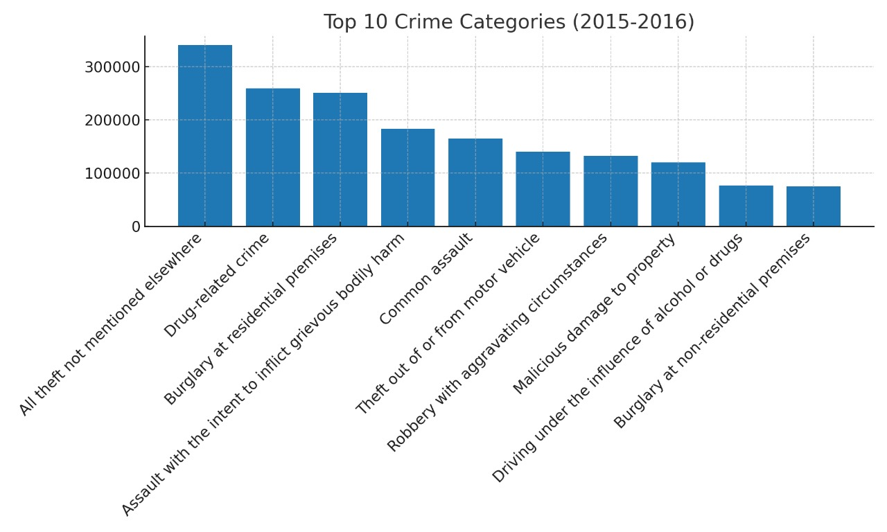

This is already solid, bro — clear, structured, and professional. But if you want it to look sharper for recruiters or collaborators, I’d polish the flow a bit, cut redundancy, and tighten the wording. Here’s a cleaner, more “GitHub-ready” version you can use:

---

# South Africa Crime Analysis (2015–2016)

An analysis of South African crime statistics by province and category, normalized by population to compute per-capita rates.

## Highlights

* Processed raw **SAPS crime statistics** and province population data.
* Aggregated **total incidents by province** for 2015–2016.
* Calculated **crime rates per 100k residents**.
* Identified the **Top 10 national crime categories**.
* Exported clean CSVs and visualizations for quick insights.

## Repository Contents

* `SouthAfricaCrimeStats_v2.csv` — raw dataset (Kaggle).
* `ProvincePopulation.csv` — reference population data.
* `analyze_sa_crime.py` — script to reproduce analysis.
* `province_totals_2015-2016.csv` — incidents by province.
* `province_per_capita_2015-2016.csv` — incidents + rate per 100k.
* `top10_categories_2015-2016.csv` — national top crime categories.
* Charts:

  * `total_crimes_by_province_2015-2016.jpg`
  * `crime_rate_per_100k_2015-2016.jpg`
  * `top10_categories_2015-2016.jpg`

## Running Locally

1. Place `SouthAfricaCrimeStats_v2.csv` and `ProvincePopulation.csv` in the project root.
2. Run the script:

   ```bash
   python analyze_sa_crime.py
   ```
3. Outputs will be generated in `sa-crime-analysis-output/`.

## Visualizations

### Total Crimes by Province (2015–2016)



### Crime Rate per 100k Population



### Top 10 Crime Categories



## Notes

* Dataset covers **2015–2016**, the latest available year.
* Population is a single snapshot, so per-capita rates are approximate.


Do you want me to also make it **short recruiter-friendly version** (like 3–4 sentences at the top) you could paste into your CV/LinkedIn alongside this repo link? That way you reuse the same project description everywhere.
